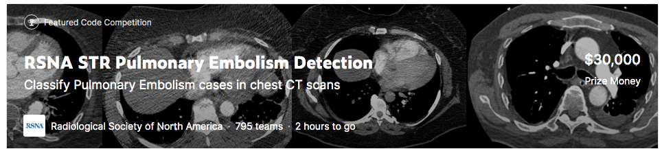
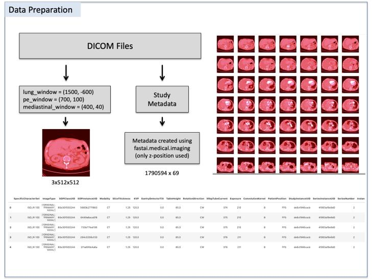
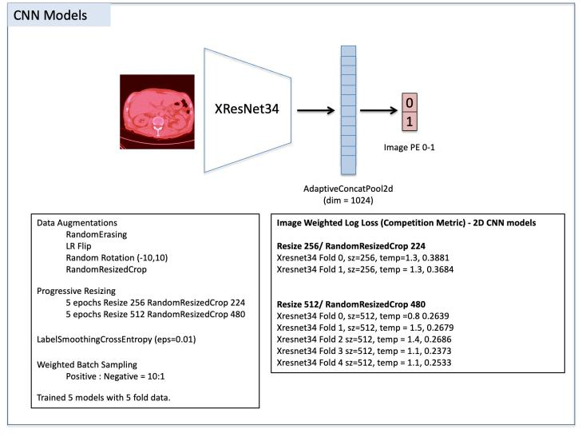
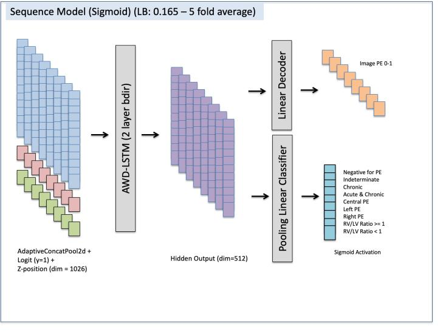
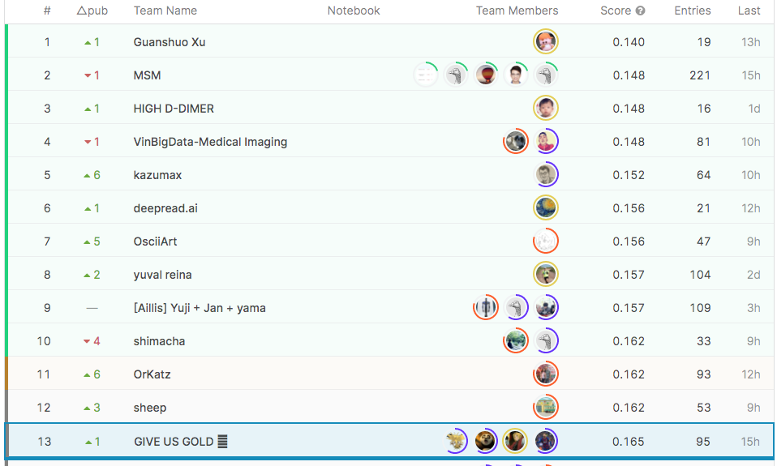

# RSNA Pulmonary Embolism AI Challenge 2020
### *Classify Pulmonary Embolism cases in chest CT scans*



[Link to competition hosted in Kaggle](https://www.kaggle.com/c/rsna-str-pulmonary-embolism-detection)

If every breath is strained and painful, it could be a serious and potentially life-threatening condition. A pulmonary embolism (PE) is caused by an artery blockage in the lung. It is time consuming to confirm a PE and prone to overdiagnosis. Machine learning could help to more accurately identify PE cases, which would make management and treatment more effective for patients.

**Objective:** Detect and classify PE cases. In particular, we'll use chest CT pulmonary angiography (CTPA) images (grouped together as studies) to enable more accurate identification of PE. 

With 60,000-100,000 PE deaths annually in the United States, it is among the most fatal cardiovascular diseases. Timely and accurate diagnosis will help these patients receive better care and may also improve outcomes. If successful, this approach will help reduce human delays and errors in detection and treatment.

<br>

### Dataset

[More information here](https://www.kaggle.com/c/rsna-str-pulmonary-embolism-detection/data)


Note also that the private test set is approximately 3x larger than the public test set (230GB vs. 70GB), so ensure that your kernels have enough time to finish their re-run. 

- The training set includes 7279 studies. (900 GB)
- Validation or Public Leaderboard (LB) set includes 650 studies. (70GB)
- Test set or Private Leaderboard set has 1517 studies. (230 GB)

Images (CTPA) in DICOM format. The images are grouped in directories by **study** and **series**. Each study has from 60 to +600 images from CT scans grouped in different series.

### What am I predicting?

We are predicting a number of labels, at both the image and study level. 

At image level:

- ```PE present on image```, notes whether any form of pulmonary embolism (PE) is present on the image.

At exam level:

- ```Negative``` exam for PE (whether there are any images in the study that have PE present).
- ```Indeterminate``` fro PE, indicates that while the study is not negative for PE, an ultimate set of exam-level labels could not be created, due to QA issues.
- ```RV/LV ratio``` present in the study (>= 1 or <1).
- PE ```Location```: left side, center, right side.
- is PE in the study ```chronic```? or is it both ```acute AND chronic```?.


**Label Consistency Requirement (Explainable AI)**

The following graph helps to prove that our model is **medically consistent** ([more info here](https://www.kaggle.com/c/rsna-str-pulmonary-embolism-detection/discussion/183473))


<br>

### Preprocessing

More information from Dr. Ian Pan [here](https://www.kaggle.com/c/rsna-str-pulmonary-embolism-detection/discussion/183473)

- 8-bit RGB 512 x 512 images.
- Windowing technique for these CT scans:

```
RED channel / LUNG window / level=-600, width=1500
GREEN channel / PE window / level=100, width=700
BLUE channel / MEDIASTINAL window / level=40, width=400
```




<br>

### Approach





### Results

**13th of 799 teams**

[Check Leaderboard (LB) here](https://www.kaggle.com/c/rsna-str-pulmonary-embolism-detection/leaderboard)

- Public LB (650 unseen studies): 0.161
- Private LB (1517 unseen studies): 0.165



<br>

### Collab examples

soon

### Training and inference

soon

